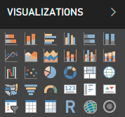
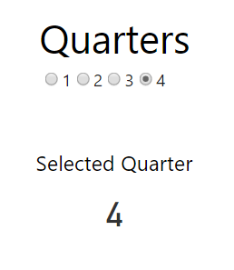

# Power BI Radio Slicer Custom Visual

This is a bare bones sample visual that demonstrates what you need to create your own slicer using the [Power BI Custom Visual SDK](https://github.com/Microsoft/PowerBI-visuals-tools).  A "slicer" is a control that allows you to filter a report based on a selected value.

The "Radio Slicer" control simply renders a radio button for every category databound to it. When you click on a radio button the rest of the report will be filtered by that radio button's value.

> If you'd like to just use this visual, then you can download it here: [Download Radio Slicer](https://github.com/jonbgallant/PowerBI-visuals-radioSlicer/releases)

If you want to learn how to create your own slicer, you can follow along at this blog post: [How to Create a Power BI Slicer with the Power BI Custom Visual SDK](http://blog.jongallant.com/powerbi-custom-slicer)

I intentionally made this as simple as possible to demonstrate what is required to create a custom slicer. I also created a more complete slicer example that can be found here: [PowerBI-visuals-rangeSlider](https://github.com/jonbgallant/PowerBI-visuals-rangeSlider).